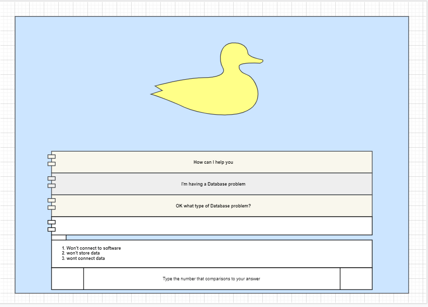

# rubber-duck

## A rubber duck debugging tool.

This project aims to work as a mentoring device for programmers who may have hit the proverbial brick wall. It gathers basic information on the type of project that a developer is completing, and then asks relevant questions to guide the programmers thinking process.

Written in C# and WPF.

## Analysis

For the user story diagrams see:

For the Sequence diagram see:

## User stories

### A user has a problem and needs a solution. The AI will suggest a solution biased on the information it has been given by the user.

Examples are:

1. As a Front end I would like a way to easily solve layout issues I am having such as things overlapping or not sitting on the right side of the screen. This is important as this is the main thing the user will see and they layout not being correct can be a usability issue.

2. As a Junior Developer I would like a simple way to decipher common problems so that I fix them myself to save other people’s time. This is important as my coworkers may not always be able to help me when I’m stuck on a problem.

3. As a Back-end developer, I would like a way to find solutions to database integration problems to ensure the projects runs correctly. This is important as if the backend isn’t irrigated properly it will course problems when you try to run the program and will unusable.

4. As a Software Development Engineer in Test (SDET) I would like a way to find solutions to ensure my tests work properly and are accurate. This is key as its part of testing and if testing isn’t done right you will have a end product that will have lots of problems and can be very difficult to use or unusable.

5. As a Big Data Developer, I would like to find simple solutions to why my databases aren’t retrieving or storing data correctly. Retrieving and storing data correctly is under GDPR and a legal requirement and key data is necessary for some systems to run.

## Acceptance criteria

1. The Rubber Duck AI will give a response in fast time. (0.5 sec)
2. Dropdown options for the user to pick from as responses to ensure they get the right solutions.
3. Accurate responses to a range of common problems. These will include layout and database problems.

## User interface

